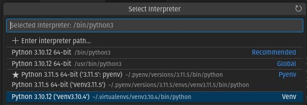

# Environments
You need to install [python](./Installs.md) first.

## Venv (virtualenv in python2)
[packaging.python.org](https://packaging.python.org/en/latest/guides/installing-using-pip-and-virtual-environments/)

### Install pip
```bash
python3 -m pip install --user --upgrade pip
python3 -m pip --version
python3 -m pip install --user virtualenv
```

### Create Virtual Environment
```bash
python3 -m venv env
```

```bash
bbearce@pop-os:~/Desktop/venv_demo$ python3 -m venv env
bbearce@pop-os:~/Desktop/venv_demo$ ls
env
bbearce@pop-os:~/Desktop/venv_demo$ source env/bin/activate
(env) bbearce@pop-os:~/Desktop/venv_demo$ deactivate
bbearce@pop-os:~/Desktop/venv_demo$ . env/bin/activate # abreviated
(env) bbearce@pop-os:~/Desktop/venv_demo$
```

### Install Packages
```bash
python3 -m pip install pandas
python3 -m pip uninstall -y pandas
```

Short:
```bash
pip install pandas
pip uninstall -y pandas
```
```bash
(env) bbearce@pop-os:~/Desktop/venv_demo$ python3 -m pip install pandas
Looking in indexes: https://pypi.org/simple, https://packagecloud.io/github/git-lfs/pypi/simple
Collecting pandas
  Obtaining dependency information for pandas from https://files.pythonhosted.org/packages/d9/26/895a49ebddb4211f2d777150f38ef9e538deff6df7e179a3624c663efc98/pandas-2.1.0-cp311-cp311-manylinux_2_17_x86_64.manylinux2014_x86_64.whl.metadata
  Downloading pandas-2.1.0-cp311-cp311-manylinux_2_17_x86_64.manylinux2014_x86_64.whl.metadata (18 kB)
Collecting numpy>=1.23.2 (from pandas)
  Obtaining dependency information for numpy>=1.23.2 from https://files.pythonhosted.org/packages/c4/36/161e2f8110f8c49e59f6107bd6da4257d30aff9f06373d0471811f73dcc5/numpy-1.26.0-cp311-cp311-manylinux_2_17_x86_64.manylinux2014_x86_64.whl.metadata
  Downloading numpy-1.26.0-cp311-cp311-manylinux_2_17_x86_64.manylinux2014_x86_64.whl.metadata (58 kB)
     ━━━━━━━━━━━━━━━━━━━━━━━━━━━━━━━━━━━━━━ 58.5/58.5 kB 1.2 MB/s eta 0:00:00
Collecting python-dateutil>=2.8.2 (from pandas)
  Using cached python_dateutil-2.8.2-py2.py3-none-any.whl (247 kB)
Collecting pytz>=2020.1 (from pandas)
  Obtaining dependency information for pytz>=2020.1 from https://files.pythonhosted.org/packages/32/4d/aaf7eff5deb402fd9a24a1449a8119f00d74ae9c2efa79f8ef9994261fc2/pytz-2023.3.post1-py2.py3-none-any.whl.metadata
  Downloading pytz-2023.3.post1-py2.py3-none-any.whl.metadata (22 kB)
Collecting tzdata>=2022.1 (from pandas)
  Downloading tzdata-2023.3-py2.py3-none-any.whl (341 kB)
     ━━━━━━━━━━━━━━━━━━━━━━━━━━━━━━━━━━━━ 341.8/341.8 kB 8.4 MB/s eta 0:00:00
Collecting six>=1.5 (from python-dateutil>=2.8.2->pandas)
  Using cached six-1.16.0-py2.py3-none-any.whl (11 kB)
Downloading pandas-2.1.0-cp311-cp311-manylinux_2_17_x86_64.manylinux2014_x86_64.whl (12.6 MB)
   ━━━━━━━━━━━━━━━━━━━━━━━━━━━━━━━━━━━━━━━ 12.6/12.6 MB 46.8 MB/s eta 0:00:00
Downloading numpy-1.26.0-cp311-cp311-manylinux_2_17_x86_64.manylinux2014_x86_64.whl (18.2 MB)
   ━━━━━━━━━━━━━━━━━━━━━━━━━━━━━━━━━━━━━━━ 18.2/18.2 MB 34.0 MB/s eta 0:00:00
Downloading pytz-2023.3.post1-py2.py3-none-any.whl (502 kB)
   ━━━━━━━━━━━━━━━━━━━━━━━━━━━━━━━━━━━━━ 502.5/502.5 kB 51.5 MB/s eta 0:00:00
Installing collected packages: pytz, tzdata, six, numpy, python-dateutil, pandas
Successfully installed numpy-1.26.0 pandas-2.1.0 python-dateutil-2.8.2 pytz-2

(env) bbearce@pop-os:~/Desktop/venv_demo$

(env) bbearce@pop-os:~/Desktop/venv_demo$ python3 -m pip uninstall -y pandas
Found existing installation: pandas 2.1.0
Uninstalling pandas-2.1.0:
  Successfully uninstalled pandas-2.1.0
```

> It's best practive to put virtual environments in ~/.virtualenvs. VSCode and other IDE's will look here by default for python virtual environments.
```bash
bbearce@pop-os:~/Desktop/venv_demo$ ls -la ~/.virtualenvs
total 16
drwxrwxr-x  4 bbearce bbearce 4096 Jul 22  2022 .
drwxr-xr-x 77 bbearce bbearce 4096 Sep 17 15:40 ..
drwxrwxr-x  6 bbearce bbearce 4096 Jul 22  2022 venv3.10.4
```

VSCode Example:



## Pyenv
[Official Docs](https://github.com/pyenv/pyenv)  
[realpython.com](https://realpython.com/intro-to-pyenv/#installing-pyenv) (they use the above to guide you)

If ```venv``` was manual, ```pyenv``` is automatic and steamlined to create many different environments and virtual environments.

When you use ```venv``` you are copying your main python installation into a virtual environment. You are locked into that version for virtual environements unless you manually install different python versions on your system.

With ```pyenv```, you do have to have these base python environments, but instead of installing where they normally go on your os, they are collected and managed by pyenv in ```~/.pyenv/versions```: 

```bash
bbearce@pop-os:~/Desktop/venv_demo$ ls -la ~/.pyenv
-rw-r--r--  1 bbearce bbearce      7 Sep 16 16:02 version
drwxr-xr-x  3 bbearce bbearce   4096 Sep 16 16:29 versions
...

bbearce@pop-os:~/Desktop/venv_demo$ ls ~/.pyenv/versions
3.11.5  venv3.11.5
```

Via special pyenv bash scripts, not python installations as with venv above, we can install multiple python versions (```3.11.5```) and virtual environments(```venv3.11.5```). They live in the same directory, though the virtual environments are sylinks to ./envs/ under each actual python version.

```bash
bbearce@pop-os:~/Desktop/venv_demo$ ls -la ~/.pyenv/versions/
drwxr-xr-x  7 bbearce bbearce 4096 Sep 16 16:29 3.11.5
lrwxrwxrwx  1 bbearce bbearce   52 Sep 16 16:29 venv3.11.5 -> /home/bbearce/.pyenv/versions/3.11.5/envs/venv3.11.5

bbearce@pop-os:~/Desktop/venv_demo$ ls -la ~/.pyenv/versions/3.11.5/envs/
drwxr-xr-x 5 bbearce bbearce 4096 Sep 16 16:29 venv3.11.5
```

So you can have *any* python version with *any* number of unique virtual environments.

### Create (install) Environment

See environments availabe:
```bash
pyenv install --list # all
pyenv install --list | grep " 3\.[678]" # get specific
  3.6.0
  3.6-dev
  3.6.1
  3.6.2
  3.6.3
  3.6.4
  3.6.5
  3.6.6
  3.6.7
  3.6.8
  3.7.0
  3.7-dev
  3.7.1
  3.7.2
  3.8-dev
```

```bash
pyenv install 3.10.4
# pyenv uninstall 3.10.4 # Uninstall
# rm -rf ~/.pyenv/versions/3.10.4 # Equivalent

```
```bash
bbearce@pop-os:~/Desktop/venv_demo$ pyenv install 3.10.4
Downloading Python-3.10.4.tar.xz...
-> https://www.python.org/ftp/python/3.10.4/Python-3.10.4.tar.xz
Installing Python-3.10.4...
...
Installing Python-3.10.4...
Installed Python-3.10.4 to /home/bbearce/.pyenv/versions/3.10.4
```

```bash
bbearce@pop-os:~/Desktop/venv_demo$ ls -la ~/.pyenv/versions
drwxr-xr-x  6 bbearce bbearce 4096 Sep 17 17:03 3.10.4
drwxr-xr-x  7 bbearce bbearce 4096 Sep 16 16:29 3.11.5
lrwxrwxrwx  1 bbearce bbearce   52 Sep 16 16:29 venv3.11.5 -> /home/bbearce/.pyenv/versions/3.11.5/envs/venv3.11.5
```

### Create Virtual Environment
> You need a pyenv plugin called [pyenv-virtualenv](https://github.com/pyenv/pyenv-virtualenv).

```bash
# Ubuntu based install...check for your os
git clone https://github.com/pyenv/pyenv-virtualenv.git $(pyenv root)/plugins/pyenv-virtualenv
```

Create:
```bash
bbearce@pop-os:~/Desktop/venv_demo$ pyenv virtualenv 3.10.4 venv3.10.4

bbearce@pop-os:~/Desktop/venv_demo$ ls -la ~/.pyenv/versions
drwxr-xr-x  6 bbearce bbearce 4096 Sep 17 17:03 3.10.4
drwxr-xr-x  7 bbearce bbearce 4096 Sep 16 16:29 3.11.5
lrwxrwxrwx  1 bbearce bbearce   52 Sep 16 16:29 venv3.11.5 -> /home/bbearce/.pyenv/versions/3.11.5/envs/venv3.11.5

bbearce@pop-os:~/Desktop/venv_demo$ pyenv virtualenv 3.10.4 venv3.10.4
bbearce@pop-os:~/Desktop/venv_demo$ ls -la ~/.pyenv/versions
drwxr-xr-x  7 bbearce bbearce 4096 Sep 17 17:19 3.10.4
drwxr-xr-x  7 bbearce bbearce 4096 Sep 16 16:29 3.11.5
lrwxrwxrwx  1 bbearce bbearce   52 Sep 17 17:19 venv3.10.4 -> /home/bbearce/.pyenv/versions/3.10.4/envs/venv3.10.4
lrwxrwxrwx  1 bbearce bbearce   52 Sep 16 16:29 venv3.11.5 -> /home/bbearce/.pyenv/versions/3.11.5/envs/venv3.11.5
```

### Using Environments
There are a variety of ways to specify when and which env\venv you want to use. Here are the most basic.

#### Global
By default you are using a global ```pyenv``` version specified by a file in ```~/.pyenv/version```.
```bash
bbearce@pop-os:~/Desktop/venv_demo$ cat ~/.pyenv/version
3.11.5
```

Set it with:
```bash
pyenv global <version>
```
```bash
bbearce@pop-os:~/Desktop/venv_demo$ pyenv version
3.11.5 (set by /home/bbearce/.pyenv/version)

bbearce@pop-os:~/Desktop/venv_demo$ pyenv versions
  system
  3.10.4
  3.10.4/envs/venv3.10.4
* 3.11.5 (set by /home/bbearce/.pyenv/version)
  3.11.5/envs/venv3.11.5
  venv3.10.4 --> /home/bbearce/.pyenv/versions/3.10.4/envs/venv3.10.4
  venv3.11.5 --> /home/bbearce/.pyenv/versions/3.11.5/envs/venv3.11.5
```

```bash
bbearce@pop-os:~/Desktop/venv_demo$ python
Python 3.11.5 (main, Sep 16 2023, 15:49:34) [GCC 11.4.0] on linux
Type "help", "copyright", "credits" or "license" for more information.
>>>
```


#### Shell
Activates for quick use (essentially the same as ```venv```).
```bash
pyenv shell <version>
```
Regular env:
```bash
bbearce@pop-os:~/Desktop/venv_demo$ pyenv shell 3.11.5
bbearce@pop-os:~/Desktop/venv_demo$ pyenv version
3.11.5 (set by PYENV_VERSION environment variable)
```

Virtualenv:
```bash
pyenv activate <version>
pyenv deactivate
```
```bash
bbearce@pop-os:~/Desktop/venv_demo$ pyenv activate venv3.11.5
(venv3.11.5) bbearce@pop-os:~/Desktop/venv_demo$ pyenv version
venv3.11.5 (set by PYENV_VERSION environment variable)
(venv3.11.5) bbearce@pop-os:~/Desktop/venv_demo$ pyenv deactivate
bbearce@pop-os:~/Desktop/venv_demo$ 
```
You can use these with shell too.
```bash
bbearce@pop-os:~/Desktop/venv_demo$ pyenv shell venv3.11.5
(venv3.11.5) bbearce@pop-os:~/Desktop/venv_demo$ pyenv version
venv3.11.5 (set by PYENV_VERSION environment variable)
```
However deactivate doesn't work:
```bash
(venv3.11.5) bbearce@pop-os:~/Desktop/venv_demo$ pyenv deactivate
bbearce@pop-os:~/Desktop/venv_demo$ pyenv shell venv3.11.5
(venv3.11.5) bbearce@pop-os:~/Desktop/venv_demo$ pyenv deactivate
(venv3.11.5) bbearce@pop-os:~/Desktop/venv_demo$ deactivate
pyenv-virtualenv: deactivate must be sourced. Run 'source deactivate' instead of 'deactivate'
(venv3.11.5) bbearce@pop-os:~/Desktop/venv_demo$ source deactivate
pyenv-virtualenv: deactivate 3.11.5/envs/venv3.11.5
# Need to use shell again to switch
(venv3.11.5) bbearce@pop-os:~/Desktop/venv_demo$ pyenv shell 3.11.5
```


#### Local
This is set for a direcory or project and creates a ```.python-version``` inside the directory
```bash
pyenv local <version>
```
```bash
bbearce@pop-os:~/Desktop/venv_demo$ pyenv version
3.11.5 (set by /home/bbearce/.pyenv/version)
bbearce@pop-os:~/Desktop/venv_demo$ pyenv local venv3.11.5
(venv3.11.5) bbearce@pop-os:~/Desktop/venv_demo$ ls -la
drwxrwxr-x 5 bbearce bbearce  4096 Sep 17 15:32 env
-rw-rw-r-- 1 bbearce bbearce    11 Sep 17 17:29 .python-version
-rw-rw-r-- 1 bbearce bbearce 22572 Sep 17 15:48 vscode-venv.jpg
(venv3.11.5) bbearce@pop-os:~/Desktop/venv_demo$ cat .python-version 
venv3.11.5
(venv3.11.5) bbearce@pop-os:~/Desktop/venv_demo$ pyenv version
venv3.11.5 (set by /home/bbearce/Desktop/venv_demo/.python-version)
(venv3.11.5) bbearce@pop-os:~/Desktop/venv_demo$ rm .python-version # deactivates and removes .python-version
bbearce@pop-os:~/Desktop/venv_demo$
```

## PDM
[pdm.fming.dev/latest](https://pdm.fming.dev/latest/)
> Warning: [PEP 582 has been rejected](https://pdm.fming.dev/2.9/usage/pep582/)

PDM was created to mimic npm whereby you don't need virtualenvs. All you need are base pythons and ```__pypackages__```. Instead of bundling your packages with venvs, which are copies of base environmetns, why don't we use a single ```3.11.5``` and have **projects** with packages that all use the same base ```3.11.5``` version or any other version you'd like. 

PS: You can and unfortunately should use vitualenvs with pdm as PEP 582 has been rejected which was the whole point. Nonetheless this package manager is nice and organized. It uses .toml files like [Poetry](https://python-poetry.org/) to manage depedencies so it is nice still. 

### Install
```bash
# Linux\Mac
curl -sSL https://pdm.fming.dev/install-pdm.py | python3 -
```

### New Project
```bash
mkdir ~/Documents/pdm_setup_andexperimentation && cd ~/Documents/pdm_setup_andexperimentation
```
```bash
pdm init
```

#### Virtualenvs and not PEP 582
[Source](https://pdm.fming.dev/latest/usage/venv/)

You can choose the backend used by PDM to create a virtualenv. Currently it supports three backends:

* virtualenv(default)  
* venv  
* conda  

##### Local Virtual Environment
```bash
bbearce@pop-os:~/Documents/pdm_setup_andexperimentation$ pdm init
Creating a pyproject.toml for PDM...
Please enter the Python interpreter to use
0. /home/bbearce/.pyenv/shims/python3 (3.11)
1. /home/bbearce/.pyenv/versions/3.11.5/bin/python (3.11)
2. /home/bbearce/.pyenv/versions/3.11.5/bin/python3.11 (3.11)
3. /home/bbearce/.pyenv/shims/python3.11 (3.11)
4. /home/bbearce/.pyenv/shims/python (3.11)
5. /home/bbearce/.pyenv/shims/python3.10 (3.10)
6. /usr/bin/python3.10 (3.10)
7. /home/bbearce/.pyenv/versions/3.10.4/bin/python3.10 (3.10)
Please select (0): 6
Would you like to create a virtualenv with /usr/bin/python3.10? [y/n] (y): y
Virtualenv is created successfully at /home/bbearce/Documents/pdm_setup_andexperimentation/.venv
Is the project a library that is installable?
If yes, we will need to ask a few more questions to include the project name and build backend [y/n] (n): n
License(SPDX name) (MIT):  
Author name (Benjamin Bearce): 
Author email (bbearce@gmail.com): 
Python requires('*' to allow any) (>=3.10): 
Project is initialized successfully
```

> We can use any environment (regular or virtual) to start this project, including virtual ones we make upon running ```pdm init```.

We can see the .venv directory which was made from ```/usr/bin/python3.10```.
```bash
bbearce@pop-os:~/Documents/pdm_setup_andexperimentation$ ls -la
total 40
drwxrwxr-x  6 bbearce bbearce 4096 Sep 17 18:25 .
drwxr-xr-x 36 bbearce bbearce 4096 Sep 17 14:17 ..
-rw-r--r--  1 bbearce bbearce 3102 Sep 17 13:47 .gitignore
-rw-rw-r--  1 bbearce bbearce   69 Sep 17 18:24 .pdm-python
drwxrwxr-x  2 bbearce bbearce 4096 Sep 17 18:25 __pycache__
-rw-rw-r--  1 bbearce bbearce  217 Sep 17 18:25 pyproject.toml
-rw-r--r--  1 bbearce bbearce   18 Sep 17 13:47 README.md
drwxrwxr-x  3 bbearce bbearce 4096 Sep 17 18:25 src
drwxrwxr-x  3 bbearce bbearce 4096 Sep 17 18:25 tests
drwxrwxr-x  4 bbearce bbearce 4096 Sep 17 18:24 .venv
```

PDM Info:
> If Project Packages is None (as show below by it not being present), virtualenv mode is enabled.
```bash
bbearce@pop-os:~/Documents/pdm_setup_andexperimentation$ pdm info
PDM version:
  2.9.2
Python Interpreter:
  /home/bbearce/Documents/pdm_setup_andexperimentation/.venv/bin/python (3.10)
Project Root:
  /home/bbearce/Documents/pdm_setup_andexperimentation
Local Packages:

bbearce@pop-os:~/Documents/pdm_setup_andexperimentation$ pdm info --env
{
  "implementation_name": "cpython",
  "implementation_version": "3.10.12",
  "os_name": "posix",
  "platform_machine": "x86_64",
  "platform_release": "6.4.6-76060406-generic",
  "platform_system": "Linux",
  "platform_version": "#202307241739~1694621917~22.04~ac5e1a8 SMP PREEMPT_DYNAMIC Wed S",
  "python_full_version": "3.10.12",
  "platform_python_implementation": "CPython",
  "python_version": "3.10",
  "sys_platform": "linux"
}
```

##### Create Your Own Virtual Environment
```bash
# Create a virtualenv based on 3.8 interpreter
$ pdm venv create 3.8
# Assign a different name other than the version string
$ pdm venv create --name for-test 3.8
# Use venv as the backend to create, support 3 backends: virtualenv(default), venv, conda
$ pdm venv create --with venv 3.9
```

Notice you need an interpreter installed to use correctly:
```bash
bbearce@pop-os:~/Documents/pdm_setup_andexperimentation$ pdm venv create 3.8
[VirtualenvCreateError]: Can't resolve python interpreter 3.8
bbearce@pop-os:~/Documents/pdm_setup_andexperimentation$ pdm venv create --name for-test 3.8
[VirtualenvCreateError]: Can't resolve python interpreter 3.8
bbearce@pop-os:~/Documents/pdm_setup_andexperimentation$ pdm venv create --with venv 3.9
[VirtualenvCreateError]: Can't resolve python interpreter 3.9
```

Use ```3.11.5``` that we have:
```bash
bbearce@pop-os:~/Documents/pdm_setup_andexperimentation$ pdm venv create 3.11.5
Virtualenv /home/bbearce/Documents/pdm_setup_andexperimentation/.venv is created successfully
bbearce@pop-os:~/Documents/pdm_setup_andexperimentation$ ls -la
total 44
drwxrwxr-x  6 bbearce bbearce 4096 Sep 17 19:00 .
drwxr-xr-x 36 bbearce bbearce 4096 Sep 17 14:17 ..
-rw-r--r--  1 bbearce bbearce 3102 Sep 17 13:47 .gitignore
-rw-rw-r--  1 bbearce bbearce 8119 Sep 17 18:39 pdm.lock
drwxrwxr-x  2 bbearce bbearce 4096 Sep 17 18:25 __pycache__
-rw-rw-r--  1 bbearce bbearce  239 Sep 17 18:39 pyproject.toml
-rw-r--r--  1 bbearce bbearce   18 Sep 17 13:47 README.md
drwxrwxr-x  3 bbearce bbearce 4096 Sep 17 18:25 src
drwxrwxr-x  3 bbearce bbearce 4096 Sep 17 18:25 tests
drwxrwxr-x  4 bbearce bbearce 4096 Sep 17 19:00 .venv
bbearce@pop-os:~/Documents/pdm_setup_andexperimentation$
```

```bash
bbearce@pop-os:~/Documents/pdm_setup_andexperimentation$ pdm venv create --name for-test 3.11.5
Virtualenv /home/bbearce/.local/share/pdm/venvs/pdm_setup_andexperimentation-wABLsGD0-for-test is created successfully
```

```bash
bbearce@pop-os:~/Documents/pdm_setup_andexperimentation$ pdm venv create --with venv 3.11.5
Virtualenv /home/bbearce/Documents/pdm_setup_andexperimentation/.venv is created successfully
```

Reuse the virtualenv you created elsewhere:
This will create file ```.pdm-python```:
```bash
pdm use -f /home/bbearce/.local/share/pdm/venvs/pdm_setup_andexperimentation-wABLsGD0-for-test 

bbearce@pop-os:~/Documents/pdm_setup_andexperimentation$ cat .pdm-python 
/home/bbearce/.local/share/pdm/venvs/pdm_setup_andexperimentation-wABLsGD0-for-test/bin/python3
```

List all virtualenvs created with this projects:
```bash
bbearce@pop-os:~/Documents/pdm_setup_andexperimentation$ pdm venv list
Virtualenvs created with this project:

-  in-project: /home/bbearce/Documents/pdm_setup_andexperimentation/.venv
*  for-test: /home/bbearce/.local/share/pdm/venvs/pdm_setup_andexperimentation-wABLsGD0-for-testbbearce@pop-os:~/Documents/pdm_setup_andexperimentation$ pdm venv list
Virtualenvs created with this project:

-  in-project: /home/bbearce/Documents/pdm_setup_andexperimentation/.venv
*  for-test: /home/bbearce/.local/share/pdm/venvs/pdm_setup_andexperimentation-wABLsGD0-for-test
```

Remove a virtualenv:
```bash
pdm venv remove for-test
```

Activate a virtualenv:
```bash
eval $(pdm venv activate)
```

```bash
bbearce@pop-os:~/Documents/pdm_setup_andexperimentation$ eval $(pdm venv activate)
(pdm_setup_andexperimentation-3.11) bbearce@pop-os:~/Documents/pdm_setup_andexperimentation$
bbearce@pop-os:~/Documents/pdm_setup_andexperimentation$ which python
/home/bbearce/Documents/pdm_setup_andexperimentation/.venv/bin/python


bbearce@pop-os:~/Documents/pdm_setup_andexperimentation$ eval $(pdm venv activate for-test)
(pdm_setup_andexperimentation-3.11) bbearce@pop-os:~/Documents/pdm_setup_andexperimentation$ which python
/home/bbearce/.local/share/pdm/venvs/pdm_setup_andexperimentation-wABLsGD0-for-test/bin/python
```

> Remember the python interpreter you are using in this project is set in ```.pdm-python```

#### PEP 582
Don't make a virtualenv:
```bash
bbearce@pop-os:~/Documents/pdm_setup_andexperimentation$ pdm init
Creating a pyproject.toml for PDM...
Please enter the Python interpreter to use
0. /home/bbearce/.pyenv/shims/python3 (3.11)
1. /home/bbearce/.pyenv/versions/3.11.5/bin/python (3.11)
2. /home/bbearce/.local/share/pdm/venvs/pdm_setup_andexperimentation-wABLsGD0-for-test/bin/python (3.11)
3. /home/bbearce/.pyenv/versions/3.11.5/bin/python3.11 (3.11)
4. /home/bbearce/.pyenv/shims/python3.11 (3.11)
5. /home/bbearce/.pyenv/shims/python (3.11)
6. /home/bbearce/.pyenv/shims/python3.10 (3.10)
7. /usr/bin/python3.10 (3.10)
8. /home/bbearce/.pyenv/versions/3.10.4/bin/python3.10 (3.10)
Please select (0): 7
Would you like to create a virtualenv with /usr/bin/python3.10? [y/n] (y): n 
You are using the PEP 582 mode, no virtualenv is created.
For more info, please visit https://peps.python.org/pep-0582/
Is the project a library that is installable?
If yes, we will need to ask a few more questions to include the project name and build backend [y/n] (n): n
License(SPDX name) (MIT): 
Author name (Benjamin Bearce): 
Author email (bbearce@gmail.com): 
Python requires('*' to allow any) (>=3.10): 
Project is initialized successfully
```

```bash
bbearce@pop-os:~/Documents/pdm_setup_andexperimentation$ cat .pdm-python 
/usr/bin/python3.10

bbearce@pop-os:~/Documents/pdm_setup_andexperimentation$ ls -la
-rw-r--r--  1 bbearce bbearce 3102 Sep 17 13:47 .gitignore
-rw-rw-r--  1 bbearce bbearce   19 Sep 17 19:17 .pdm-python
drwxrwxr-x  2 bbearce bbearce 4096 Sep 17 19:17 __pycache__
-rw-rw-r--  1 bbearce bbearce  217 Sep 17 19:17 pyproject.toml
-rw-r--r--  1 bbearce bbearce   18 Sep 17 13:47 README.md
drwxrwxr-x  3 bbearce bbearce 4096 Sep 17 19:17 src
drwxrwxr-x  3 bbearce bbearce 4096 Sep 17 19:17 tests
```

```bash

```


### Manage Depedencies
[Source](https://pdm.fming.dev/latest/usage/dependency/)

```bash
pdm add <dependency>
```

```bash
pdm add pandas
```

Let's look at the files used to manage this project:
```pyproject.toml```: Overall project management (check into git)
```bash
bbearce@pop-os:~/Documents/pdm_setup_andexperimentation$ cat pyproject.toml
[project]
name = ""
version = ""
description = ""
authors = [
    {name = "Benjamin Bearce", email = "bbearce@gmail.com"},
]
dependencies = [
    "pandas>=2.1.0",
]
requires-python = ">=3.10"
readme = "README.md"
license = {text = "MIT"}
```

```pdm.lock```: All pandas (and or others as needed) dependencies and is not to be touched (check into git)
```bash
bbearce@pop-os:~/Documents/pdm_setup_andexperimentation$ cat pdm.lock
# This file is @generated by PDM.
# It is not intended for manual editing.

[metadata]
groups = ["default"]
cross_platform = true
static_urls = false
lock_version = "4.3"
content_hash = "sha256:dc9eafceda8a739aabf7f0d33d89566090337630b57dbc7a482740a5b8863523"

[[package]]
name = "numpy"
version = "1.26.0"
requires_python = "<3.13,>=3.9"
summary = "Fundamental package for array computing in Python"
files = [
...
```

```.pdm-python```: Interpreter (do not check into git)
```bash
cat .pdm-python
/home/bbearce/Documents/pdm_setup_andexperimentation/.venv/bin/python
```

```bash
pdm list

bbearce@pop-os:~/Documents/pdm_setup_andexperimentation$ pdm list
╭─────────────────┬──────────────┬──────────╮
│ name            │ version      │ location │
├─────────────────┼──────────────┼──────────┤
│ numpy           │ 1.26.0       │          │
│ pytz            │ 2023.3.post1 │          │
│ six             │ 1.16.0       │          │
│ tzdata          │ 2023.3       │          │
│ pandas          │ 2.1.0        │          │
│ python-dateutil │ 2.8.2        │          │
╰─────────────────┴──────────────┴──────────╯

bbearce@pop-os:~/Documents/pdm_setup_andexperimentation$ pdm list --graph
pandas 2.1.0 [ required: >=2.1.0 ]
├── numpy 1.26.0 [ required: >=1.22.4 ]
├── python-dateutil 2.8.2 [ required: >=2.8.2 ]
│   └── six 1.16.0 [ required: >=1.5 ]
├── pytz 2023.3.post1 [ required: >=2020.1 ]
└── tzdata 2023.3 [ required: >=2022.1 ]
```


### Using Python:
