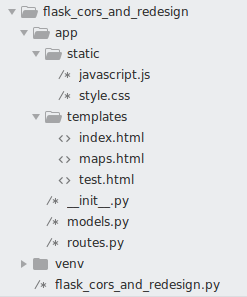

# Flask Setup

> Source [Miguel Grinberg](https://blog.miguelgrinberg.com/post/the-flask-mega-tutorial-part-i-hello-world) and [Real Python](https://realpython.com/tutorials/flask/)

[This](https://realpython.com/flask-google-login/) is a great login tutorial



*flask_cors_and_redesign.py*
Here all we need to do is import the app
```python
from app import app
```

*app/\_\_init\_\_.py*
```
from flask import Flask
from flask_cors import CORS

app = Flask(__name__)
CORS(app)

from app import routes

```

*app/routes.py*
```python
from app import app
from flask import render_template, jsonify

import math

@app.route('/', methods=['GET'])
def index():
    return render_template('index.html', variable='test_variable')

@app.route('/api', methods=['GET'])
def api():
    return jsonify({'data' : 'Hello World!'})

@app.route('/map', methods=['GET'])
def map():
    return render_template('maps.html')
    # return jsonify({'data' : 'Hello World!'})

@app.route('/get_latlngs', methods=['GET'])
def get_latlngs():
    
    zip_latlng = {
        'lat': 42.3601,
        'lng': -71.0589,
    }

    post_latlngs = [
        {'lat': 0, 'lng': 0},
        {'lat': 0, 'lng': 0},
        {'lat': 0, 'lng': 0},
        {'lat': 0, 'lng': 0},
    ]

    num_of_posts = len(post_latlngs)
    rad_spacing = 2*math.pi/num_of_posts
    radius = 1

    for i,v in enumerate(post_latlngs):
        post_latlngs[i]['lat'] = zip_latlng['lat'] + radius*math.cos(i*rad_spacing)
        post_latlngs[i]['lng'] = zip_latlng['lng'] + radius*math.sin(i*rad_spacing)


    return jsonify(post_latlngs)

```

*app/models.py*
```python
# Not shown, but this layout is for directory structure mainly.
```
Before running it, though, Flask needs to be told how to import it, by setting the ```FLASK_APP``` environment variable:
```
(venv) $ export FLASK_APP=microblog.py
```
