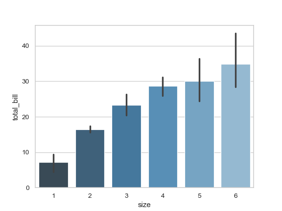

# Seaborn

>Source []()

```python
import seaborn as sns
```

## Bar Plot 

>Source [seaborn](https://seaborn.pydata.org/generated/seaborn.barplot.html)

```python
sns.set(style="whitegrid")
tips = sns.load_dataset("tips")
ax = sns.barplot(x="day", y="total_bill", data=tips)
```


```python
ax = sns.barplot(x="day", y="total_bill", hue="sex", data=tips)
```


```python
ax = sns.barplot(x="day", y="tip", data=tips, capsize=.2)
```


```python
ax = sns.barplot("size", y="total_bill", data=tips,
                 palette="Blues_d")
```



## Heatmap

ax = sns.heatmap(A_V_A)

## Axes and Plot Options

>Source [drawingfromdata](https://www.drawingfromdata.com/setting-figure-size-using-seaborn-and-matplotlib)

### Rotate Axes

```python
import seaborn as sns
planets = sns.load_dataset("planets")
g = sns.factorplot("year", data=planets, aspect=1.5, kind="count", color="b")
g.set_xticklabels(rotation=30)
```

