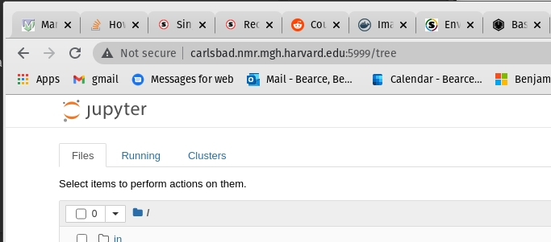
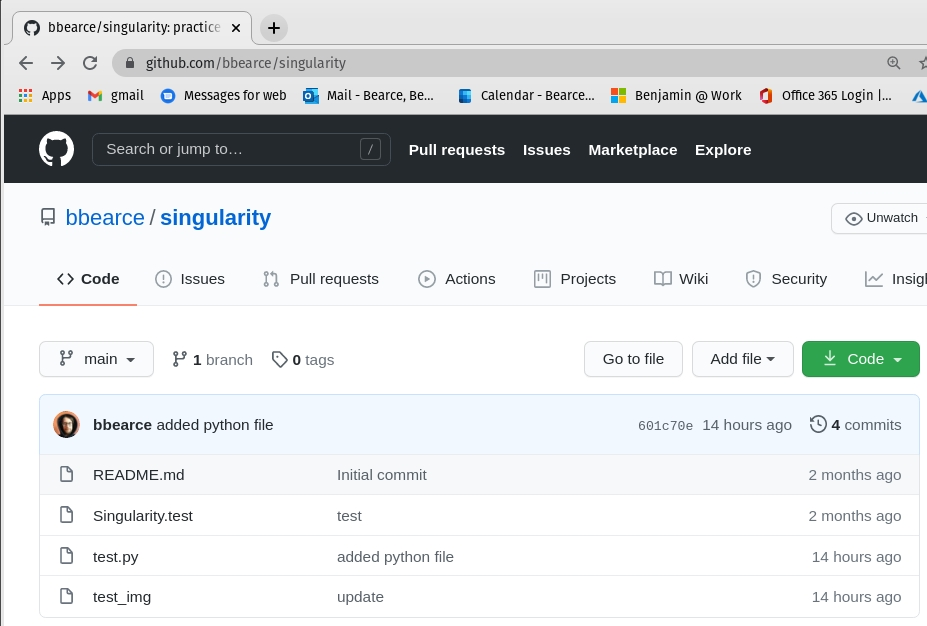
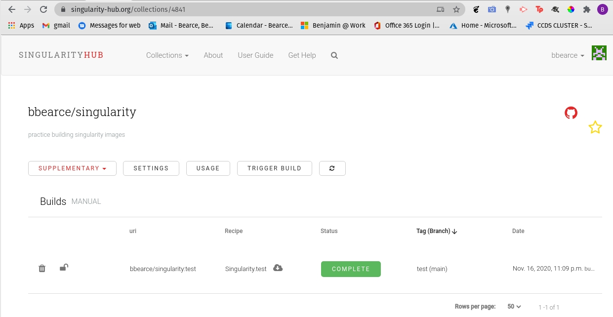
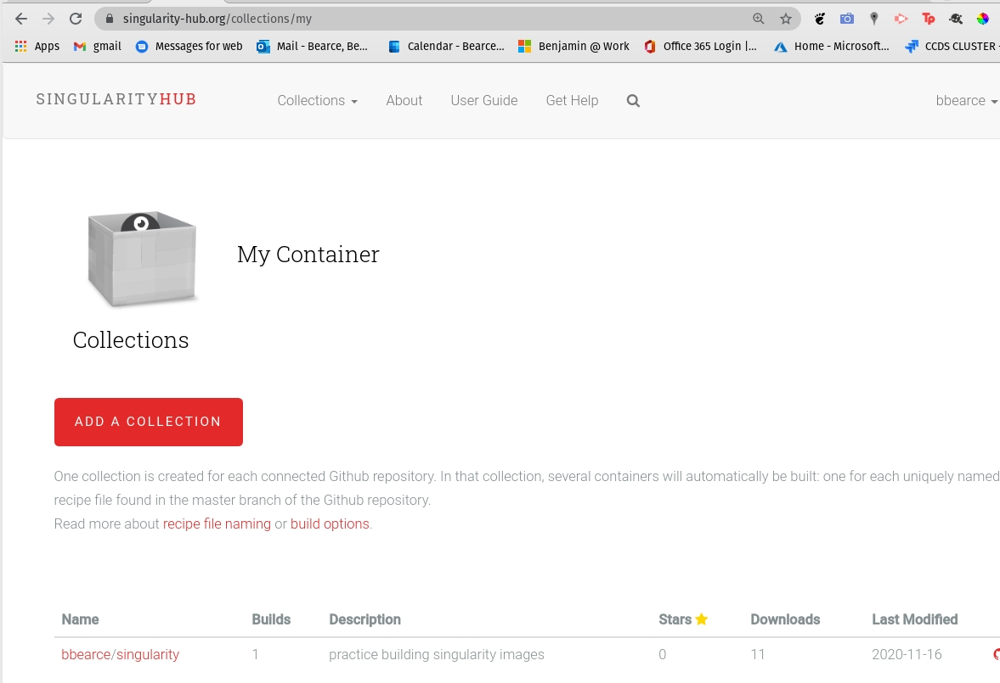
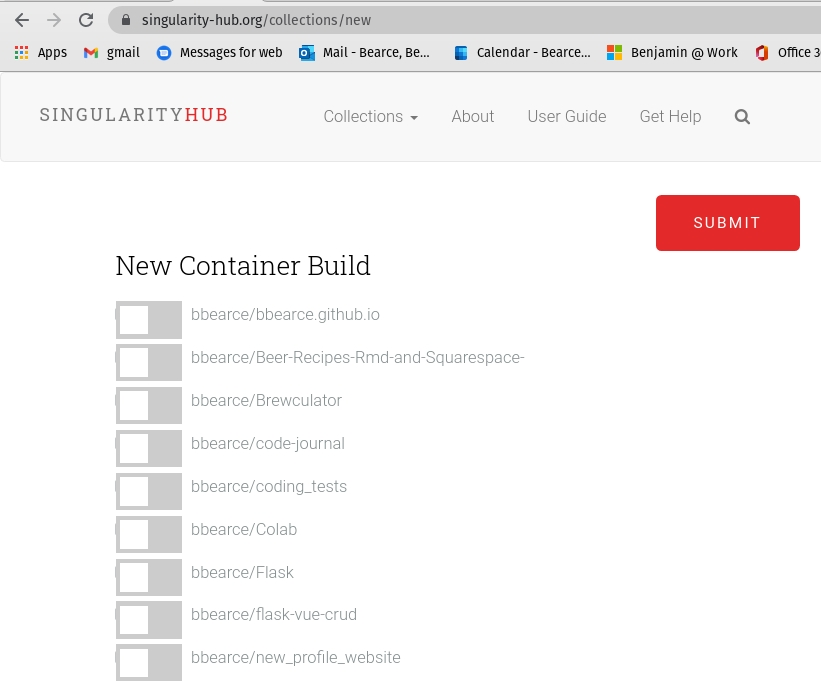

# Demo Martinos Cluster

## Storage

We have storage (20TB) on Martinos accessible at:

* ```/cluster/qtim``` (convenient path)
* ```/vault/cluster/qtim``` (real path)

Here is what is there:
```bash
(base) carlsbad[0]:qtim$ cd /cluster/qtim
(base) carlsbad[0]:qtim$ ls -la
total 2
drwxrws--- 4 root  qtim 5 Nov 16 14:59 .
drwxr-xr-x 4 root  root 0 Nov 16 14:57 ..
-rw-r--r-- 1 root  root 0 Nov 12 23:24 ID-qtim
drwxrwsr-x 4 bb927 qtim 4 Nov 16 14:59 machine_backups
drwxrwsr-x 5 bb927 qtim 5 Nov 16 14:58 users

(base) carlsbad[0]:qtim$ ls machine_backups/
bryce  getafix

(base) carlsbad[0]:qtim$ ls users
bb927  kalpathy  yifen
```

> For future use and organization I think we should keep users in a ```users```folder. Other high level folders at the ```users``` or ```machine_backups``` level can be created as needed, but I'm proposing some best practices as of now. 

For general use we need to use this space when using machines managed by help desk (carlsbad, dotter, the new martinos GPU cluster). We have user accounts that are synced between all martinos machines and they all live on a drive managed by help desk. In order to keep space concerns down with 100s of users, they limit our space allowance to the point where it is unusable for more than configuratoin or tiny tests. 

It is because of this that the most important step is to symlink some important directories to change where the data stored for various programs (docker, singularity, python) will show up ultimately (not in ```~/```). 


## Setup simlinks:
> Source [Martinos Docs](https://www.nmr.mgh.harvard.edu/martinos/userInfo/computer/docker.php)

The two places that need symlinking are ```~/.singularity``` and ```~/.share/local/containers```. Here is an example:

> (make sure ~/.singularity does not already exist first)

```bash
ls -la ~
...

lrwxrwxrwx   1 bb927 bb927    33 Sep 29 12:48 .share -> /cluster/qtim/users/bb927/share
lrwxrwxrwx   1 bb927 bb927    39 Sep 29 12:44 .singularity -> /cluster/qtim/users/bb927/singularity

...
```

I do have some and I will delete them to demonstrate the full workflow:

```bash
(base) carlsbad[0]:bb927$ cd /cluster/qtim/users/bb927
(base) carlsbad[0]:bb927$ ls
(base) carlsbad[0]:bb927$ mkdir share singularity
(base) carlsbad[0]:bb927$ ls
share  singularity
(base) carlsbad[0]:bb927$ ln -s /cluster/qtim/users/bb927/share ~/.share
(base) carlsbad[0]:bb927$ ln -s /cluster/qtim/users/bb927/singularity ~/.singularity

(base) carlsbad[0]:bb927$ mkdir ~/.singularity/tmp
(base) carlsbad[0]:bb927$ export SINGULARITY_TMPDIR=~/.singularity/tmp
(base) carlsbad[0]:bb927$ mkdir ~/.singularity/cache
(base) carlsbad[0]:bb927$ export SINGULARITY_CACHEDIR=~/.singularity/cache
```

## Singularity

### Must know

[1] Images are read-only by default...more on that later.

[2] You are not ```root``` inside your image, but rather your username on linux (Ex: ```bb927```).

[3] Remember Singularity wants to auto ```--bind``` mount these 3 directories in the background whether you say to or not:

* /home/$USER  
* /tmp  
* $PWD 

[4] The concept of differentiating between image and container is no more. They are one in the same...more on that later.

[5] For editable images (sandboxes) you must create your mount points ahead of time in the sandbox.


### Build from Recipe

**Do you need administrator privileges to use Singularity?**

You generally do not need admin/sudo to *use* Singularity containers but you do however need admin/root access to *install* Singularity and for some container *build* functions (for example, building from a recipe, or a writable image).

### The Recipe File

Bootstrap let's us know that we are using a container from dockerhub to build off of. This should be similar to the Dockerfile from docker. Most of this should be self explainatory.
```bash
Bootstrap: docker
From: ubuntu:18.04

%help
    This is where you can add some useful info.

%labels
    Creator Ben

%environment
    export MY_VAR='~~~~~some environment variable~~~~~'

%files
    test.py   /

%post
    apt-get -qq -y update
    apt-get -qq -y install python > /dev/null

%runscript
    python /test.py


```

test.py:
```python
import os

if __name__ == '__main__':
    print('import os module and clearly python is installed!')
    print(os.environ['MY_VAR'])

```

Sections in recipe file:

* help: Give some help   
* labels: Impart meta-data into container  
* environment: Environment variables  
* files: Copy files into container   
* post: Run commands once container is created  
* runscript: A command to run by default   

**Build Images from Scratch**

Use this command to build the recipe file into a ```*.simg```

```bash
(base) carlsbad[0]:bb927$ singularity build ubuntu.simg Singularity.recipe
FATAL:   You must be the root user, however you can use --remote or --fakeroot to build from a Singularity recipe file
```
...as I said we don't have permissions. I will need this demo for later so I will show how to get it running in the long run.

> Hint you can always build somewhere else first...


### Build from Docker

Let's say I start with ubuntu from docker (btw you can grab images from shub:// as well):
```bash
singularity build ubuntu.simg docker://ubuntu:latest
```

Now let's see our image (unlike docker we won't use ```docker ps``` or ```docker images```, rather all containers\images live where you execute commands):
```bash
(base) carlsbad[0]:bb927$ ls
share  singularity  ubuntu.simg
```

Now this is read only and can just be run or you can shell into it:

```bash
(base) carlsbad[0]:bb927$ singularity shell ubuntu.simg 
Singularity> ls
share  singularity  ubuntu.simg
```

> Notice that since the user's $PWD directory is automatically mounted it shows the \*.simg with ```ls```, so don't be alarmed if your singularity directory looks just like your current directory! However we know we are *in the singularity ;)* (couldn't resist) because ```/``` is not the same outside the container.

```bash
Singularity> ls /
autofs  boot     dev          etc   homes  lib32  libx32  mnt  proc  run   singularity  sys  usr
bin cluster  environment  home  lib    lib64  media   opt  root  sbin  srv      tmp  var
Singularity> exit
exit

(base) carlsbad[0]:bb927$ ls /
autofs  boot     cmas  dev   etc   homes  lib64        lost+found  misc  nas  opt    proc  run   scratch  srv  tmp  var
bin     cluster  data  eris  home  lib    local_mount  media       mnt   net  panfs  root  sbin  space    sys  usr  vast
```

### Types of Containers


#### Default 

You may be wondering while shelling into the container, was that the image or did we shell into an instance container?!? Neither. Singularity has one *thing* and is always an image, but may have writable copies created for development work. You could think of these writable versions as containers if you'd like, but that is the main paradigm shift when using this techinology.

Let's learn more with examples:

```bash
Singularity> ls
share  singularity  ubuntu.simg
Singularity> touch test_file.txt
Singularity> touch /test_file.txt
touch: cannot touch '/test_file.txt': Read-only file system
```

Notice here that you can add files to the mount point ```$PWD```, but not ```/```. These images are read-only by default with the exception of mount points. So how do we make editable images?

#### Sandbox ```--sandbox```

So we can't edit ```ubuntu.simg``` by default, but we can build an editable version with ```singularity build --sandbox```:

```bash
(base) carlsbad[0]:bb927$ singularity build --sandbox s_ubuntu ubuntu.simg
WARNING: 'nodev' mount option set on /autofs/cluster/qtim, it could be a source of failure during build process
INFO:    Starting build...
INFO:    Creating sandbox directory...
INFO:    Build complete: s_ubuntu

(base) carlsbad[0]:bb927$ ls
share  singularity  s_ubuntu  test_file.txt  ubuntu.simg
```

Notice how we build it out of the original \*.simg container we had. You can base a sandbox on shub or dockerhub images as well.

so let's see what is inside:

```bash
(base) carlsbad[0]:bb927$ ls s_ubuntu/
bin   dev          etc   lib    lib64   media  opt   root  sbin         srv  tmp  var
boot  environment  home  lib32  libx32  mnt    proc  run   singularity  sys  usr
```

An entire ubuntu os! Cool so now let's change stuff in it:

```bash
(base) carlsbad[0]:bb927$ singularity shell s_ubuntu
Singularity> touch /mnt/anything.txt
touch: cannot touch '/mnt/anything.txt': Read-only file system
```

So even though we made a sandbox which is desinged to be interactive, we still need the ```--writable``` flag or it will be a read only image. What is going on behind the scenes is really just the ```*.simg``` format being converted to a directory. This directory is still read only if shelled into. 

> Note if you don't shell into the image, it is editable from outside! This will be necessary for some mounts later as we will see. 

```bash
(base) carlsbad[0]:bb927$ singularity shell --writable s_ubuntu 
WARNING: Your current working directory is a symlink and may not be available in container, you should use real path with --writable when possible
WARNING: Skipping mount /etc/localtime [binds]: /etc/localtime doesn't exist in container
WARNING: By using --writable, Singularity can't create /homes destination automatically without overlay or underlay
FATAL:   container creation failed: mount /var/singularity/mnt/session/homes->/homes error: while mounting /var/singularity/mnt/session/homes: destination /homes doesn't exist in container
```

**- !!!UGH!!! What?... -**

So remember that singularity wants to auto mount your home directory ```/home/$USER``` but this is a symlink in and of itself! So we need a little secret sauce for this to work. Singularity has a ```--no-home--``` flag we can use to tell it not to mount the ```/home/$USER``` directory.


```bash
(base) carlsbad[0]:bb927$ singularity shell --writable --no-home s_ubuntu 
WARNING: Your current working directory is a symlink and may not be available in container, you should use real path with --writable when possible
WARNING: Skipping mount /etc/localtime [binds]: /etc/localtime doesn't exist in container
WARNING: Skipping mount /cluster/qtim/users/bb927 [cwd]: /autofs/cluster/qtim/users/bb927 doesn't exist in container
Singularity> touch /mnt/anything.txt
Singularity> exit
exit

(base) carlsbad[0]:bb927$ ls s_ubuntu/
bin   dev          etc   lib    lib64   media  opt   root  sbin         srv  tmp  var
boot  environment  home  lib32  libx32  mnt    proc  run   singularity  sys  usr
(base) carlsbad[0]:bb927$ ls s_ubuntu/mnt
anything.txt
```

Now how do we turn it into a new image when we make changes? Just as you can build from docker images and singularity images and even singularity files, you can also build from sandboxes.

```bash
(base) carlsbad[0]:bb927$ singularity build s_ubuntu_modified s_ubuntu
WARNING: 'nodev' mount option set on /autofs/cluster/qtim, it could be a source of failure during build process
INFO:    Starting build...
INFO:    Creating SIF file...
INFO:    Build complete: s_ubuntu_modified

(base) carlsbad[0]:bb927$ ls
share  singularity  s_ubuntu  s_ubuntu_modified  test_file.txt  ubuntu.simg
```

Now let's see if our change made it:

```bash
(base) carlsbad[0]:bb927$ singularity shell s_ubuntu_modified 
Singularity> ls /mnt/        
anything.txt
```

Boom! So to recap, you need to build a ```--sandbox``` image from just about any image source, be it a hub or recipe file. Then shell into that container directory with flag ```--writable```. Don't forget the ```--no-home``` flag.

**So we can just install software right?**

well...yes, but...

```bash
Singularity> apt update -y
Hit:1 http://security.ubuntu.com/ubuntu focal-security InRelease
...
Singularity> apt-get install vim -y;
Reading package lists... Done
Building dependency tree       
Reading state information... Done
...
...
dpkg: error: requested operation requires superuser privilege
E: Sub-process /usr/bin/dpkg returned an error code (2)
Singularity> 
```

What now?

So remeber that singulariy doesn't let you run as root but rather as your normal user? However you can't install (some) software without being root. So we need to be root without being root...


Last wonky flag I promise, but we need to be ```--fake-root```. Install as this user.


```bash
(base) carlsbad[0]:bb927$ singularity shell --writable --no-home --fakeroot s_ubuntu
WARNING: Your current working directory is a symlink and may not be available in container, you should use real path with --writable when possible
WARNING: Skipping mount /etc/localtime [binds]: /etc/localtime doesn't exist in container
WARNING: Skipping mount /cluster/qtim/users/bb927 [cwd]: /autofs/cluster/qtim/users/bb927 doesn't exist in container
Singularity> apt update -y; apt-get install vim -y;
Hit:1 http://security.ubuntu.com/ubuntu focal-security InRelease
...
W: chown to _apt:root of directory /var/cache/apt/archives/partial failed - SetupAPTPartialDirectory (1: Operation not permitted)
W: chown to _apt:root of directory /var/lib/apt/lists/auxfiles failed - SetupAPTPartialDirectory (1: Operation not permitted)
W: Download is performed unsandboxed as root as file '/var/cache/apt/archives/partial/libmagic-mgc_1%3a5.38-4_amd64.deb' couldn't be accessed by user '_apt'. - pkgAcquire::Run (13: Permission denied)
W: chown to root:adm of file /var/log/apt/term.log failed - OpenLog (1: Operation not permitted)

Singularity> vim


~                                                                                                                             
~                                                                                                                             
~                                                                                                                             
~                                                                                                                             
~                                                     VIM - Vi IMproved                                                       
~                                                                                                                             
~                                                      version 8.1.2269                                                       
~                                                  by Bram Moolenaar et al.                                                   
...
```

So it works despite some rather concerning messages. Starting from ubuntu installing python worked and so did pip3, but using pip3 to install pandas failed because of a missing certificate. 

> I tried a python image and stil lcouldn't install pandas, though I didn'tspend much time on it. Flask did work...We might have to practice a bit with this or only use fully formed images on this system.

## Run

Use ```singularity run``` like docker:

> This image is the demo from earlier using the ```Singularity.recipe``` recipe file and ```test.py```.

```bash
(base) carlsbad[0]:bb927$ singularity run shub://bbearce/singularity:test
INFO:    Downloading shub image
 58.24 MiB / 58.24 MiB [=========================================================================================] 100.00% 16.88 MiB/s 3s
import os module and clearly python is installed!
~~~~~some environment variable~~~~~
```

So it ran and printed some stuff. Cool, but we really care about interactive mode.

> At the end I will discuss uploading images to shub and bulding from github repos.

### Useful flags

Here are some of the flags we will need routinely:

#### ```-B``` or ```--bind```

> Note mounts can be specified as read only ```ro``` or read write ```rw``` (default).

This is equivalent to dockers ```-v``` flag. Use this to mount directories:

```bash
(base) carlsbad[0]:bb927$ pwd
/cluster/qtim/users/bb927
(base) carlsbad[0]:bb927$ mkdir in
(base) carlsbad[0]:bb927$ mkdir out
(base) carlsbad[0]:bb927$ singularity shell -B ./in:/mnt/in -B ./out:/mnt/out s_ubuntu/
Singularity> ls /mnt/in
Singularity> ls /mnt/out
Singularity> touch /mnt/out/anything.txt
Singularity> exit
exit
(base) carlsbad[0]:bb927$ ls out
anything.txt

Singularity> 
```

you can comma delimit multiple mounts:

```bash
(base) carlsbad[0]:bb927$ singularity shell -B ./in:/mnt/in,./out:/mnt/out s_ubuntu/
Singularity> ls /mnt/out
anything.txt
Singularity> 
```

If you do not specify where in the container you mount to, the local mount will be mounted to the same directory inside the container:

```bash
(base) carlsbad[0]:bb927$ singularity shell -B /opt s_ubuntu/
Singularity> ls /opt
containerd  google  microsoft  rh
Singularity> exit
exit
(base) carlsbad[0]:bb927$ ls /opt
containerd  google  microsoft  rh
```

> This is the same as ```-B /opt:/opt```

#### ```--fakeroot```

This is important for interactive development because since you are not "root" normally you can't install stuff with apt-get. With this you can.

#### ```--net```

Gives you internet access.

#### ```--nv```

Give container access to GPUs

```bash
(base) carlsbad[0]:bb927$ singularity shell --nv pytorch.simg
```

#### ```--no-home```

When shelling into your container image, Singularity allows you to mount your current working directory (```CWD```) without mounting your host ```$HOME``` directory with the ```--no-home``` flag.

## Jupyter Example

> Source [ljvmiranda921](https://ljvmiranda921.github.io/notebook/2018/01/31/running-a-jupyter-notebook/)

Also a note from Help Desk:

> Note from Martinos help Desk:
> If you run jupyter, you will not be able to access the port it is on (```8888```)
> remotely (such as your local machine at home over VPN) due to firewall on
> dotter. But port range ```5900-5999``` are open for VNC so if you
> force jupyter to use port ```5999``` instead of its default you can use that.

### [1] Forward via ssh in your local machine

```bash
bbearce@pop-os:~$ ssh -N -f -L localhost:5999:localhost:5999 bb927@carlsbad.nmr.mgh.harvard.edu
```

### [2] Run jupyter notebook from remote machine

```bash
(base) carlsbad[0]:bb927$ singularity shell --nv datascience-notebook_latest.sif 
Singularity> jupyter notebook --no-browser --port=5999
Fail to get yarn configuration. {"type":"warning","data":"Skipping preferred cache folder \"/home/jovyan/.cache/yarn\" because it is not writable."}
{"type":"warning","data":"Skipping preferred cache folder \"/home/scratch/.yarn-cache-4643095\" because it is not writable."}
{"type":"warning","data":"Skipping preferred cache folder \"/home/scratch/.yarn-cache\" because it is not writable."}
{"type":"error","data":"Yarn hasn't been able to find a cache folder it can use. Please use the explicit --cache-folder option to tell it what location to use, or make one of the preferred locations writable."}
{"type":"info","data":"Visit https://yarnpkg.com/en/docs/cli/config for documentation about this command."}

[I 13:48:17.304 NotebookApp] JupyterLab extension loaded from /opt/conda/lib/python3.8/site-packages/jupyterlab
[I 13:48:17.304 NotebookApp] JupyterLab application directory is /opt/conda/share/jupyter/lab
[I 13:48:17.312 NotebookApp] Serving notebooks from local directory: /autofs/cluster/qtim/users/bb927
[I 13:48:17.312 NotebookApp] Jupyter Notebook 6.1.4 is running at:
[I 13:48:17.312 NotebookApp] http://carlsbad.nmr.mgh.harvard.edu:5999/?token=26d3e282bf9f134c9059eac068d10a76d624754182d36a55
[I 13:48:17.312 NotebookApp]  or http://127.0.0.1:5999/?token=26d3e282bf9f134c9059eac068d10a76d624754182d36a55
[I 13:48:17.312 NotebookApp] Use Control-C to stop this server and shut down all kernels (twice to skip confirmation).
[C 13:48:17.323 NotebookApp] 
    
    To access the notebook, open this file in a browser:
        file:///homes/3/bb927/.local/share/jupyter/runtime/nbserver-25344-open.html
    Or copy and paste one of these URLs:
        http://carlsbad.nmr.mgh.harvard.edu:5999/?token=26d3e282bf9f134c9059eac068d10a76d624754182d36a55
     or http://127.0.0.1:5999/?token=26d3e282bf9f134c9059eac068d10a76d624754182d36a55


```

Go here: http://carlsbad.nmr.mgh.harvard.edu:5999/?token=26d3e282bf9f134c9059eac068d10a76d624754182d36a55 and you should see this:




## shub

Link to shub is: [https://singularity-hub.org/](https://singularity-hub.org/)

Recapping on our previous example, let's say you want to build from a recipe file:

Singularity.test:
```bash
Bootstrap: docker
From: ubuntu:18.04

%help
    This is where you can add some useful info.

%labels
    Creator Ben

%environment
    export MY_VAR='~~~~~some environment variable~~~~~'

%files
    test.py   /

%post
    apt-get -qq -y update
    apt-get -qq -y install python > /dev/null

%runscript
    python /test.py


```


test.py:
```python
import os

if __name__ == '__main__':
    print('import os module and clearly python is installed!')
    print(os.environ['MY_VAR'])

```

Build:

> Had to do this on my local
```bash
bbearce@pop-os:~/Documents/singularity$ ls
README.md  Singularity.test  test.py

bbearce@pop-os:~/Documents/singularity$ sudo singularity build test.simg Singularity.test
[sudo] password for bbearce: 
INFO:    Starting build...
Getting image source signatures
Copying blob 171857c49d0f skipped: already exists  
Copying blob 419640447d26 skipped: already exists  
Copying blob 61e52f862619 [--------------------------------------] 0.0b / 0.0b
Copying config 33a51d0908 done  
Writing manifest to image destination
Storing signatures
2020/11/17 13:40:36  info unpack layer: sha256:171857c49d0f5e2ebf623e6cb36a8bcad585ed0c2aa99c87a055df034c1e5848
2020/11/17 13:40:37  info unpack layer: sha256:419640447d267f068d2f84a093cb13a56ce77e130877f5b8bdb4294f4a90a84f
2020/11/17 13:40:37  info unpack layer: sha256:61e52f862619ab016d3bcfbd78e5c7aaaa1989b4c295e6dbcacddd2d7b93e1f5
INFO:    Copying test.py to /tmp/build-temp-907729936/rootfs/
INFO:    Running post scriptlet
+ apt-get -qq -y update
+ apt-get -qq -y install python
debconf: delaying package configuration, since apt-utils is not installed
INFO:    Adding help info
INFO:    Adding labels
INFO:    Adding environment to container
INFO:    Adding runscript
INFO:    Creating SIF file...
INFO:    Build complete: test.simg

bbearce@pop-os:~/Documents/singularity$ ls
README.md  Singularity.test  test.py  test.simg

```

then run:

```bash
bbearce@pop-os:~/Documents/singularity$ singularity run test.simg
import os module and clearly python is installed!
~~~~~some environment variable~~~~~
```

So shub allows you to link github repos and put code and recipe files there for auto build:



which will become this on sub:



### Add images via github:
[1]


[2]

