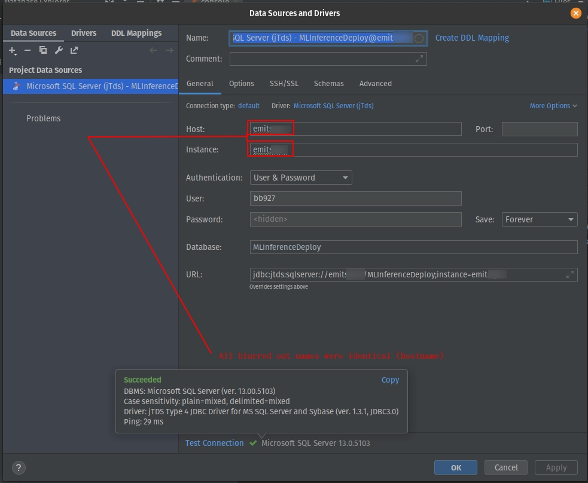

# SQL Server

```sql
SELECT "serve dat sql...chyeah!"
```

Microsoft SQL Server can be hard to connect to. Here I'm compiling some notes that help me connect in various situations.

## Drivers

### ODBC - pyodbc

This is the standard way and it works pretty well. It's pretty simple to use. 

[pyodbc](https://pypi.org/project/pyodbc/)

```python
import pyodbc

SQL_Server=""
Database=""
View=""
USER=""
PASS=""

import pyodbc
server = f'{SQL_Server}'
database = f'{Database}'
username = f'{USER}'
password = f'{PASS}'   
driver= '{ODBC Driver 17 for SQL Server}'

with pyodbc.connect('DRIVER='+driver+';SERVER=tcp:'+server+';PORT=1433;DATABASE='+database+';UID='+username+';PWD='+ password) as conn:
    with conn.cursor() as cursor:
#        cursor.execute("SELECT TOP 3 name, collation_name FROM sys.databases")
        cursor.execute("select top 10 * from viewInferencePXS")
        row = cursor.fetchone()
        while row:
            print (str(row[0]) + " " + str(row[1]))
            row = cursor.fetchone()
```

Much easier than JTDS below...

### JTDS - Java Tabular Data Stream

#### DataGrip

I was finally able to connect with the [jtds](http://jtds.sourceforge.net/):

jTDS is an open source 100% pure Java (type 4) JDBC 3.0 driver for Microsoft SQL Server (6.5, 7, 2000, 2005, 2008 and 2012) and Sybase Adaptive Server Enterprise (10, 11, 12 and 15). jTDS is based on FreeTDS and is currently the fastest production-ready JDBC driver for SQL Server and Sybase ASE. jTDS is 100% JDBC 3.0 compatible, supporting forward-only and scrollable/updateable ResultSets, concurrent (completely independent) Statements and implementing all the DatabaseMetaData and ResultSetMetaData methods. Check out the feature matrix for more details.

In DataGrip they have a connection for this driver and it looks like this when setup correctly:



#### python

To use the jtds driver in python you need these things:
* install [jaydebeapi]()
* Follow this stackoverflow article: [https://stackoverflow.com/questions/55376100/create-a-jtds-connection-string-in-python](https://stackoverflow.com/questions/55376100/create-a-jtds-connection-string-in-python)
  * under jar_path = ```"<path_to>\\jtds-1.3.1.jar"``` we need goto [http://jtds.sourceforge.net/](http://jtds.sourceforge.net/) and click on the Download navbar link and download and extract the *jtds-1.3.1-dist.zip* and then inside the extracted folder the jar is at: *jtds-1.3.1-dist/jtds-1.3.1.jar*.
* In that article you will find a script. Below is an example

```python
import sys
import jaydebeapi

SQL_Server="emitsql07"
Database="MLInferenceDeploy"
View="ViewInferencePXS"
USER="bb927"
PASS="" # I shouldn't tell you this ;)

def main():
    try:
        # jTDS Driver.
        driver_name = "net.sourceforge.jtds.jdbc.Driver"
        #driver_name = "org.hsqldb.jdbcDriver" # not sure when to use this

        # jTDS Connection string.
        connection_url = f"jdbc:jtds:sqlserver://{SQL_Server}/{Database};instance={SQL_Server};domain=PARTNERS"

        # jTDS Connection properties.
        # Some additional connection properties you may want to use
        # "domain": "<domain>"
        # "ssl": "require"
        # "useNTLMv2": "true"
        # See the FAQ for details http://jtds.sourceforge.net/faq.html
        connection_properties = {
            "user":USER,
            "password": PASS,
        }

        # Path to jTDS Jar

        # BB- !!! IMPORTANT !!! -BB
        jar_path = "/home/bbearce/Downloads/jtds-1.3.1-dist/jtds-1.3.1.jar"
        # BB- !!! IMPORTANT !!! -BB

        # Establish connection.
        connection = jaydebeapi.connect(driver_name, connection_url, connection_properties, jar_path)
        cursor = connection.cursor()

        # Execute test query.
        cursor.execute("select 1 as test_connection")

        # Execute a real query
        # cursor.execute(f"select top 1 * from {View};")

        res = cursor.fetchall()
        if res:
            print(str(res))  # Should print [(1,)] for test query or have results from a real one

    except Exception as err:
        print(str(err))


if __name__ == "__main__":
    sys.exit(main())
```
