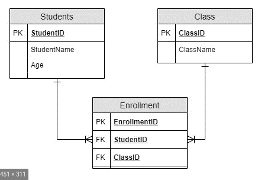

# Useful Everyday Code

## Drop If Exists

```sql
DROP TABLE [IF EXISTS] [schema_name.]table_name;
```

## Select Into

*source [stackoverflow](https://stackoverflow.com/questions/2361921/select-into-statement-in-sqlite)*

```sql
CREATE TABLE equipments_backup AS SELECT * FROM equipments
```

## Ranks / Row_Number

> Courtest of [sqlitetutorial](https://www.sqlitetutorial.net/sqlite-window-functions/sqlite-rank/)

*Window function support was first added to SQLite with release version 3.25.0 (2018-09-15). The SQLite developers used the PostgreSQL window function documentation as their primary reference for how window functions ought to behave.*

The ```RANK()``` function is a window function that assigns a rank to each row in a query’s result set. The rank of a row is calculated by one plus the number of ranks that comes before it.

The following shows the syntax of the ```RANK()``` function:

```sql
RANK() OVER (
    PARTITION BY <expression1>[{,<expression2>...}]
    ORDER BY <expression1> [ASC|DESC], [{,<expression1>...}]
)
```

> Courtesty of [sqlite](https://www.sqlite.org/windowfunctions.html)

SQLite supports the following 11 built-in window functions:

* row_number()  

    The number of the row within the current partition. Rows are numbered starting from 1 in the order defined by the ORDER BY clause in the window definition, or in arbitrary order otherwise.

* rank()  

    The row_number() of the first peer in each group - the rank of the current row with gaps. If there is no ORDER BY clause, then all rows are considered peers and this function always returns 1.

* dense_rank()  

    The number of the current row's peer group within its partition - the rank of the current row without gaps. Partitions are numbered starting from 1 in the order defined by the ORDER BY clause in the window definition. If there is no ORDER BY clause, then all rows are considered peers and this function always returns 1.

* percent_rank()  

    Despite the name, this function always returns a value between 0.0 and 1.0 equal to (rank - 1)/(partition-rows - 1), where rank is the value returned by built-in window function rank() and partition-rows is the total number of rows in the partition. If the partition contains only one row, this function returns 0.0.

* cume_dist()  

    The cumulative distribution. Calculated as row-number/partition-rows, where row-number is the value returned by row_number() for the last peer in the group and partition-rows the number of rows in the partition.

* ntile(N)  

    Argument N is handled as an integer. This function divides the partition into N groups as evenly as possible and assigns an integer between 1 and N to each group, in the order defined by the ORDER BY clause, or in arbitrary order otherwise. If necessary, larger groups occur first. This function returns the integer value assigned to the group that the current row is a part of.

## Add/Change Column Data Type

> Source [techonthenet](https://www.techonthenet.com/sqlite/tables/alter_table.php)

### Add Column
The syntax to ADD A COLUMN in a table in SQLite (using the ALTER TABLE statement) is:

```sql
ALTER TABLE table_name
  ADD new_column_name column_definition;
```

### Change Column
You can not use the ALTER TABLE statement to modify a column in SQLite. Instead you will need to rename the table, create a new table, and copy the data into the new table.

Syntax
The syntax to MODIFY A COLUMN in a table in SQLite is:

```sql
PRAGMA foreign_keys=off;

BEGIN TRANSACTION;

ALTER TABLE table1 RENAME TO _table1_old;

CREATE TABLE table1 (
( column1 datatype [ NULL | NOT NULL ],
  column2 datatype [ NULL | NOT NULL ],
  ...
);

INSERT INTO table1 (column1, column2, ... column_n)
  SELECT column1, column2, ... column_n
  FROM _table1_old;

COMMIT;

PRAGMA foreign_keys=on;
```

### Pivot Table

> Courtesty of [modern-sql](https://modern-sql.com/use-case/pivot)

Essentially what you need to do is a subquery in which the inner query has the data you want to source and pivot. The outer query will group by a *key* and **explicitly** define the columns that should be created from values in a particular row. Use *FILTER* to filter for the rows that will belong to each column. *Note:* This should be replaced by *CASE* statements in the future. 

```sql
SELECT year
     , SUM(revenue) FILTER (WHERE month =  1) jan_revenue
     , SUM(revenue) FILTER (WHERE month =  2) feb_revenue
     ...
     , SUM(revenue) FILTER (WHERE month = 12) dec_revenue
  FROM (SELECT invoices.*
             , EXTRACT(YEAR  FROM invoice_date) year
             , EXTRACT(MONTH FROM invoice_date) month
          FROM invoices 
       ) invoices
 GROUP BY year
```

## Julian Day

>Source [techonthenet](https://www.techonthenet.com/sqlite/functions/julianday.php)

Syntax:

The syntax for the julianday function in SQLite is:
```sql
julianday(timestring [, modifier1, modifier2, ... modifier_n ] )
```

More concrete example:

```sql
select
mrn,
date,
julianday(date) as j_day
from mrns_dates;
```

output:

| # | mrn     | date       | j_day     |
|---|---------|------------|-----------|
| 1 | ####### | 2011-04-19 | 2455670.5 |
| 2 | ####### | 2011-09-26 | 2455830.5 |
| 3 | ####### | 2012-02-01 | 2455958.5 |
| 4 | ####### | 2012-03-19 | 2456005.5 |
| 5 | ####### | 2012-04-24 | 2456041.5 |
| 6 | ####### | 2014-07-30 | 2456868.5 |


Notes: A date value. It can be one of the following:


| timestring              | Explanation                                                                                                            |
|-------------------------|------------------------------------------------------------------------------------------------------------------------|
| now                     | now is a literal used to return the current date                                                                       |
| YYYY-MM-DD              | Date value formatted as 'YYYY-MM-DD'                                                                                   |
| YYYY-MM-DD HH:MM        | Date value formatted as 'YYYY-MM-DD HH:MM'                                                                             |
| YYYY-MM-DD HH:MM:SS     | Date value formatted as 'YYYY-MM-DD HH:MM:SS'                                                                          |
| YYYY-MM-DD HH:MM:SS.SSS | Date value formatted as 'YYYY-MM-DD HH:MM:SS.SSS'                                                                      |
| HH:MM                   | Date value formatted as 'HH:MM'                                                                                        |
| HH:MM:SS                | Date value formatted as 'HH:MM:SS'                                                                                     |
| HH:MM:SS.SSS            | Date value formatted as 'HH:MM:SS.SSS'                                                                                 |
| YYYY-MM-DDTHH:MM        | Date value formatted as 'YYYY-MM-DDTHH:MM' where T is a literal character separating the date and time portions        |
| YYYY-MM-DDTHH:MM:SS     | Date value formatted as 'YYYY-MM-DDTHH:MM:SS' where T is a literal character separating the date and time portions     |
| YYYY-MM-DDTHH:MM:SS.SSS | Date value formatted as 'YYYY-MM-DDTHH:MM:SS.SSS' where T is a literal character separating the date and time portions |
| DDDDDDDDDD              | Julian date number                                                                                                     |


## Many to Many Relationship

```sql
/*display formatting*/
.mode column
.headers on

CREATE TABLE books (book_id int, title varchar, description varchar);
CREATE TABLE bookAuthor (bookAuthor int, author_id, book_id);
CREATE TABLE authors (author_id int, last_name varchar, first_name varchar);

insert into books (book_id, title, description) values(1, 'book1', 'Ben''s book');
insert into books (book_id, title, description) values(2, 'book2', 'Yuki''s book');
insert into books (book_id, title, description) values(3, 'book3', 'Collaboration of Yuki and Ben');

insert into bookAuthor (bookAuthor, author_id, book_id) values(1, 1, 1); /*Ben wrote this book*/
insert into bookAuthor (bookAuthor, author_id, book_id) values(2, 2, 2); /*Yuki wrote this book*/
insert into bookAuthor (bookAuthor, author_id, book_id) values(3, 1, 3); /*Ben wrote some of this book*/
insert into bookAuthor (bookAuthor, author_id, book_id) values(4, 2, 3); /*Yuki wrote some of this book*/

insert into authors (author_id, last_name, first_name) values(1, 'Bearce', 'Ben');
insert into authors (author_id, last_name, first_name) values(2, 'Davidoff', 'Yuki');

select * from books;
select * from bookAuthor;
select * from authors;

```

Which shows:
```sql
sqlite> select * from books;
book_id     title       description
----------  ----------  -----------
1           book1       Ben's book 
2           book2       Yuki's book
3           book3       Collaborati
sqlite> select * from bookAuthor;
bookAuthor  author_id   book_id   
----------  ----------  ----------
1           1           1         
2           2           2         
3           1           3         
4           2           3         
sqlite> select * from authors;
author_id   last_name   first_name
----------  ----------  ----------
1           Bearce      Ben       
2           Davidoff    Yuki      
sqlite> select * from books;
book_id     title       description
----------  ----------  -----------
1           book1       Ben's book 
2           book2       Yuki's book
3           book3       Collaborati
sqlite> select * from books where title = 'book3';
book_id     title       description                  
----------  ----------  -----------------------------
3           book3       Collaboration of Yuki and Ben
```

Now we can showcase the purpose of such a join:
```sql
select b.title, a.first_name, b.description from books as b
inner join bookAuthor as ba on b.book_id = ba.book_id
inner join authors as a on a.author_id = ba.author_id;
```

which gives:
```sql
title       first_name  description
----------  ----------  -----------
book1       Ben         Ben's book 
book2       Yuki        Yuki's book
book3       Ben         Collaborati
book3       Yuki        Collaborati
```


